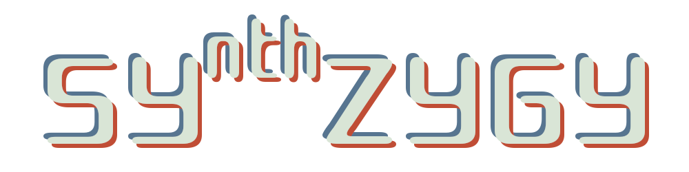

---

---

A modular synthesizer in vanilla js. Due to the fact audioworklets are used,  this will only work in Chrome.

This is currently a work in progress application. The base functionality is working, but some work has to be done.

What will I be working on:
* Better collision detection
* Saving an opening patches
* Scalable canvas, so you can make even larger patches

If you want to help, you're welcome. Just fork and create PR's.

> Read more [@Documentation](./docs/index.md)
>
> There is a [Code of conduct](./docs/code-of-conduct.md)
>
> More on [Contributing](./docs/contributing.md)

typo