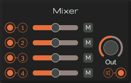

# Mixer

A Module which is used to mix several sounds together. The user can control the volume on each channel or sound source to be as loud as they want.
This mixer consists of 4 channels and has a volume slider and mute button per channel. The master knob controls the overal volume output.

## Controls per Channel

* **Slider**: Set the volume of the corresponding channel
* **Mute**: When active the corresponding channel will be muted

## Controls global

* **Out**: Set the output volume

## Inputs

* **Audio inputs**: 1 - 4; the input source per channel

## Output

* **Audio output**: The mixed output signal
