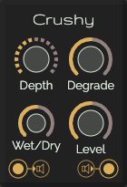

# Crushy

A Bitcrusher is a lo-fi (low fidelity) digital audio effect, which produces a distortion by the reduction of the
resolution or bandwidth of digital audio data. The resulting quantization noise may produce a “warmer” sound
impression, or a harsh one, depending on the amount of reduction.

[Read more](https://en.wikipedia.org/wiki/Bitcrusher)

## Controls

* **Depth**: The bit depth of the crusher
* **Degrade**: The amount of degradation of the sound
* **Wet/Dry**: Full till no effect
* **Level**: The output level

## Inputs

* **Audio input**: The audio signal to destroy

## Outputs

* **Audio output**: The crushed audio signal
