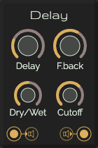

# Delay

Delay is an audio effect and an effects unit which records an input signal to an audio storage medium, and then plays it back after a period of time.[2] The delayed signal may either be played back multiple times, or played back into the recording again, to create the sound of a repeating, decaying echo.

[Read more](https://en.wikipedia.org/wiki/Delay_(audio_effect))

## Controls

| Label | Description | min | max |
| :--- | :--- | ---: | ---: |
| **Delay** | The delay time | 0s | 2s |
| **Feedback** | The time the delay is existing | 0 | .99 |
| **Dry/Wet** | Full till no effect | | |
| **Cutoff** | Frequency for sound degradation | 1000Hz | 4000Hz |

## Inputs

* **Audio input**: The audio signal to destroy

## Outputs

* **Audio output**: The crushed audio signal