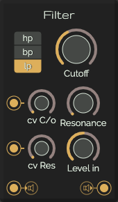

# Filter

In signal processing, a digital biquad filter is a second order recursive linear filter, containing two poles and two zeros. "Biquad" is an abbreviation of "biquadratic", which refers to the fact that in the Z domain, its transfer function is the ratio of two quadratic functions:

[Read more](https://en.wikipedia.org/wiki/Digital_biquad_filter)

## Controls

| Label | Description | min | max |
| :--- | :--- | ---: | ---: |
| **Cutoff** | The cutoff frequency | 0Hz | 20000Hz |
| **CV Cutoff** | The amount of cv padssing through to the cutoff | 0% | 100% |
| **Resonance** | Set the sustain level | 0 | 150 |
| **CV Resonance** | Set the release time | 0% | 100% |
| **Level In** | Set the output level | 0% | 100% |

## Inputs

* **CV Cutoff**: The control signal for the cutoff
* **CV resonance**: The control signal for the resonance
* **Audio input**: The audio signal to filter

## Outputs

* **Audio output**: The crushed audio signal