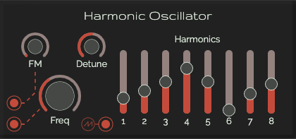

# Harmonic Oscillator

## Controls

* **Frequency**: Set the frequency to play. Disabled when the input is connected
* **Detune**: Frequency finetuning
* **FM**: Set the amount of frequency modulation applied

## Sliders [1-8]

Slider 1 is the base not of the oscilatator 2-8 are the harmonics to build a great sound with

## Inputs

* **CV frequency**: Set the frequency to play (8 octaves)
  * **min value**: 0
  * **max value**: 9 (everything more will be truncated)
* **CV FM**: Set the frequency modulation
  * **min value**: 0
  * **max value**: 9 (everything more will be truncated)

## Outputs

* **Harmonic wave**

> All outputs have the next values:
>
> * min value: -5
> * max value: 5
