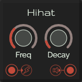

# Hihat

This is a module with a hihat-sound. Internally it is build upon 1 noise, a filter and a gain.

Inspiration for this module was gathered from this [video by Roland](https://www.youtube.com/watch?v=RyEq1U0EvSs)

## Control

| Label | Description | min | max |
| ----- | ----------- | --: | --: |
| **Freq** | The amount of oscillator sound | 2000Hz | 8000Hz |
| **Decay** | Tail after the hihat | 0.05s | 0.5s |

## Inputs

* **Gate in**: trigger the kick

## Outputs

* **Audio out**
