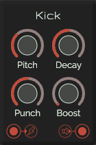
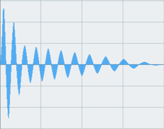

# Kick

This is a module with a kick-sound. Internally it is build upon 3 oscillators, 2 envalopes and a gain. The waves used are a triangle (base wave) and a sine an square wave (used for the boost).

Inspiration for this module was gathered from this [video by Tobi Nuemann](https://www.youtube.com/watch?v=gqh8mB4pDoU)

The kick has a parameter 'punch'. This is the initial drop in gain after the Attack has finished (in the image about the first 2 waves). The hihger the value the harder the drop. The length of the tail after the drop is the decay.

## Control

| Label | Description | min | max |
| --- | --- | ---: | ---: |
| **Pitch** | Frequency of the kick | 10Hz | 100Hz |
| **Decay** | Tail after the drop | 0.2s | 0.4s |
| **Punch** | Initial gain drop (sustain'ish) | 10% | 90% |
| **Boost** | Boosts the sound by adding 2 extra oscillators | 0 | 1 |

## Inputs

* **Gate in**: trigger the kick

## Outputs

* **Audio out**
