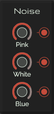

# Noise

The noise module consists of 3 seperate types of noise with all their own output. All noises are samples from
[Audiocheck.net](https://www.audiocheck.net/).

* [Pink noise](https://www.audiocheck.net/testtones_pinknoise.php)
* [White noise](https://www.audiocheck.net/testtones_whitenoise.php)
* [Blue noise](https://www.audiocheck.net/testtones_bluenoise.php)

## Controls

* **Pink**: Set the output volume of the pink noise
* **White**: Set the output volume of the white noise
* **Blue**: Set the output volume of the blue noise

## Outputs

* **Pink noise**
* **White noise**
* **Blue noise**
