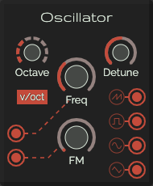

# Oscillator (VCO)

This Oscillator is build with the real-life modular VCO in mind.
A voltage-controlled oscillator (VCO) is an electronic oscillator whose oscillation frequency is controlled by a voltage input. The applied input voltage determines the instantaneous oscillation frequency.

[Read more](https://en.wikipedia.org/wiki/Voltage-controlled_oscillator)

## Controls

* **Octave**: Set the base octave
* **Frequency**: Set the frequency to play. Disabled when the input is connected
* **Detune**: Frequency finetunung
* **FM**: Set the amount of frequency modulation applied
* **V/Oct (_toggle button_)**: Only applicable when there is no CV frequency input connected
  * **On**: the full frequency range is controlled by the frequency control. The octave control has nu use here
  * **Off**: The frequency control controls only 1 octave. The octave control is used to set the octave

## Inputs

* **CV frequency**: Set the frequency to play (8 octaves)
  * **min value**: 0
  * **max value**: 9 (everything more will be truncated)
* **CV FM**: Set the frequency modulation
  * **min value**: 0
  * **max value**: 9 (everything more will be truncated)

## Outputs

* **Square wave**
* **Sine wave**
* **Saw wave**
* **Triangle wave**

> All outputs have the next values:
>   * min value: -5
>   * max value: 5
