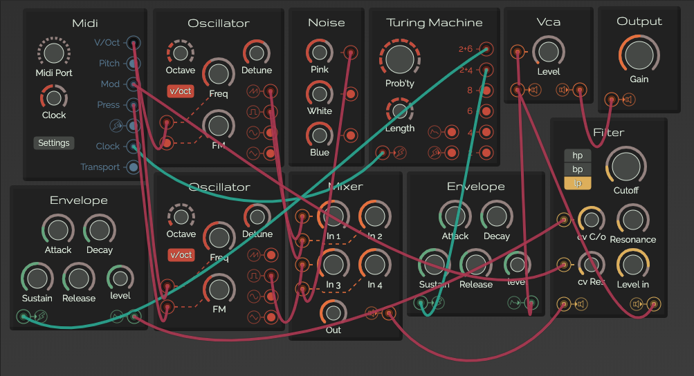

<!-- markdownlint-disable MD041 -->

<!-- markdownlint-enable MD041 -->

---

A modular synthesizer made with vanilla javascript.

> Documentation is not completed yet

## Table of contents

### Overall

* [Modules](./modules.md)
* [Usage](./usage.md)

### Generator Modules

* [Oscillator :: Generator module](./generators/oscillator.md)
* [Noise :: Generator module](./generators/noise.md)
* [Kick :: Drum module](./generators/kick.md)
* [Snare :: Drum module](./generators/snare.md)
* [Hihat :: Drum module](./generators/hihat.md)

### Modulator Modules

* [LFO :: Modulator module](./modulators/lfo.md)
* [Envelope :: Modulator module](./modulators/envelope.md)

### Effect Modules

* [Crushy :: Effect module](./modulators/bitcrush.md)
* [Delay :: Effect module](./modulators/delay.md)
* [Filter :: Effect module](./modulators/filter.md)

### Utility Modules

* [Midi :: Utility module](./utilities/midi.md)
* [Turing Machine :: Utility module](./utilities/turing.md)

### Others

* [Credits](./credits.md)
* [Code of conduct](./code-of-conduct.md)
