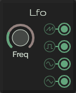

# LFO

Low-frequency oscillation (LFO) is an electronic frequency which is usually below 20 Hz and creates a rhythmic pulse or sweep.

[Read more](https://en.wikipedia.org/wiki/Low-frequency_oscillation)

## Control

* **Frequency**: Set the frequency of the LFO
  * **min value**: 0.01Hz
  * **max value**: 20Hz

## Outputs

* **Square wave**
* **Sine wave**
* **Saw wave**
* **Triangle wave**

> All with:
>   * min value: -2.5
>   * max value: 2.5
