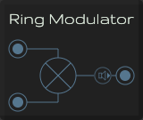

# Ring Modulator

A ring modulator multiplies two signals together to create two brand-new frequencies which are the sum and difference
of the input frequencies.

[Read more](http://synthesizeracademy.com/ring-modulator/)

## Inputs

* **Modulator**: The upper input is the Modulator
* **Carrier**: The lower input is the Carrier

## Output

* **Audio**: The modulated audio signal
