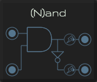

# Logical (N)and

The AND gate is a basic digital logic gate that implements logical conjunction.

A NAND gate (NOT-AND) is a logic gate which produces an output which is false only if all its inputs are true.

They behave according to the truth table below

| A | B | And | Nand |
| :---: | :---: | :---: | :---: |
| 0 | 0 | 0 | 1 |
| 0 | 1 | 0 | 1 |
| 1 | 0 | 0 | 1 |
| 1 | 1 | 1 | 0 |

[Read more](http://synthesizeracademy.com/ring-modulator/)

## Inputs

* **A**: Gate input A
* **B**: Gate input B

## Output

* **And**: When both input A and B are 1 the output is 1, 0 otherwise
* **Nand**: When both input A and B are 1 the output is 0, 1 otherwise
