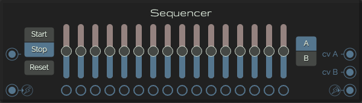

# Sequencer

This is a 2 x 16 steps sequencer, with both cv and gate outputs.

[Read more](https://en.wikipedia.org/wiki/Music_sequencer)

## Controls

* **Step sliders**: 16 sliders for cv output

## Buttons

* **Start**: Start the sequencer
* **Stop**: Stop the sequencer
* **Reset**: Go back to the first step
* **A/B**: Channel select for the sliders
* **Stepbuttons**: Selecting the steps to trigger the gate

## Inputs

* **Gate**: The clock trigger
* **Transport**: Trigger the transport buttons

## Outputs

* **Gate**: Outputs the selected steps
* **CV output A**: The CV output for channel A
* **CV output B**: The CV output for channel A
