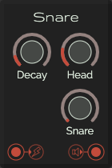

# Snare

This is a module with a snare-sound. Internally it is build upon 2 oscillators, 2 envalopes, 1 noise and a gain. The waves used are a sine.
There's a little side-effect when turning the 'Decay' knob to minimal values. This is caused because the end of the decay is prior its start, so it wil never go to 0 again 😎.

Inspiration for this module was gathered from this [article by MusicTech.net](https://www.musictech.net/tutorials/modular-eurorack-snare-tutorial/)

Other then in the article, this snare also uses an envelope for a small pitch sweep.

## Control
| Label | Description | min | max |
| ----- | ----------- | --: | --: |
| **Decay** | Tail after the snare | 0.05s | 0.5s |
| **Head** | The amount of oscillator sound | 0 | 10 |
| **Snare** | Set the frequency of the hp-filter | 2000Hz | 6000Hz |

## Inputs
* **Gate in**: trigger the kick

## Outputs
* **Audio out**
