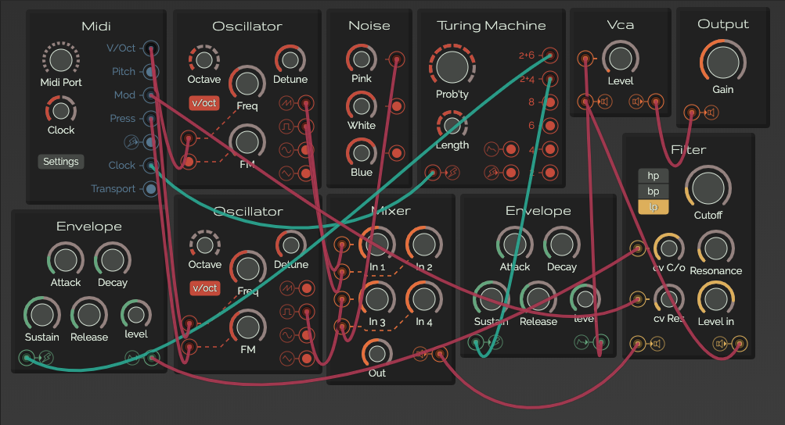
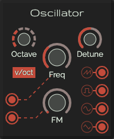
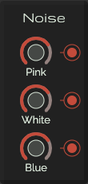
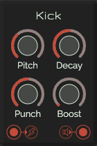
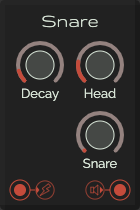
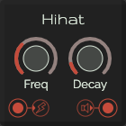
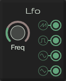
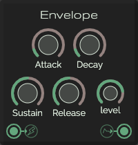
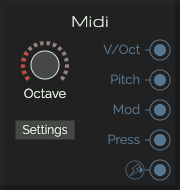
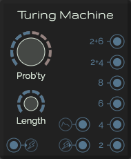

---

A modular synthesizer made with vanilla javascript

## Table of contents
### Overall
* [Modules](./modules.md)
* [Usage](./usage.md)

### Generator Modules

### Modulator Modules

### Utility Modules

### Others
* [Credits](./credits.md)
* [Code of conduct](./code-of-conduct.md)

