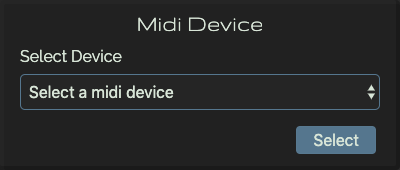

# Midi

Midi connector to connect the modular to any midi device you want.

## Control
* FreqMidi channel: Select the prefered midi channel
  * 0: All channels
  * 1-16: Channel number

## Outputs
| Label | Description | min | max |
| ----- | ----------- | --: | --: |
| **v/oct** | Note triggered | 0 | 8 |
| **pitch** | Pitch Bend | -2.5 | 2.5 |
| **mod** | Modulation wheel | 0 | 8 |
| **press** | Pressure / After touch | 0 | 8 |
| **gate** | Callback to trigger | | |

## Button
* Settings: Open the settings window to select the midi device you want to use

### future/whishlist:
* clock
* start
* stop
* pause